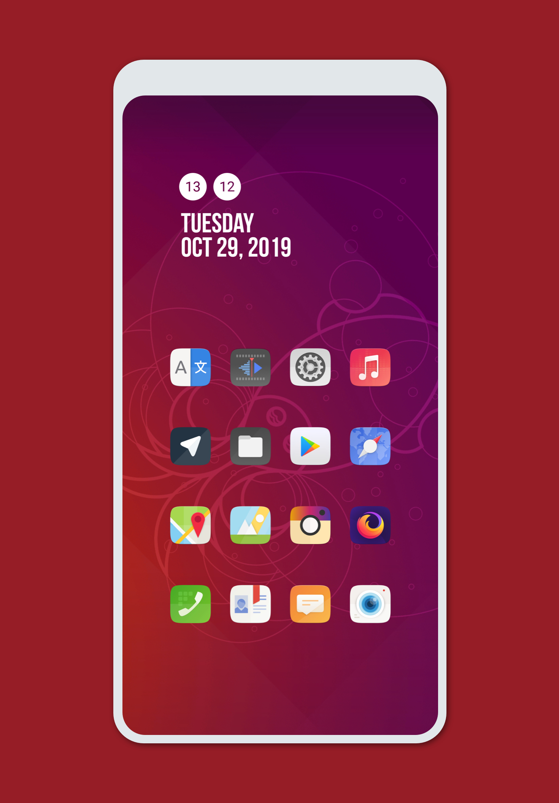
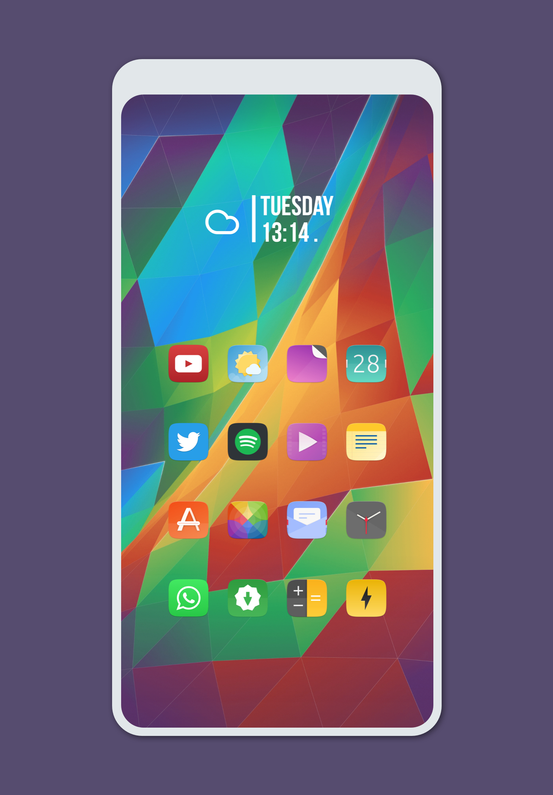
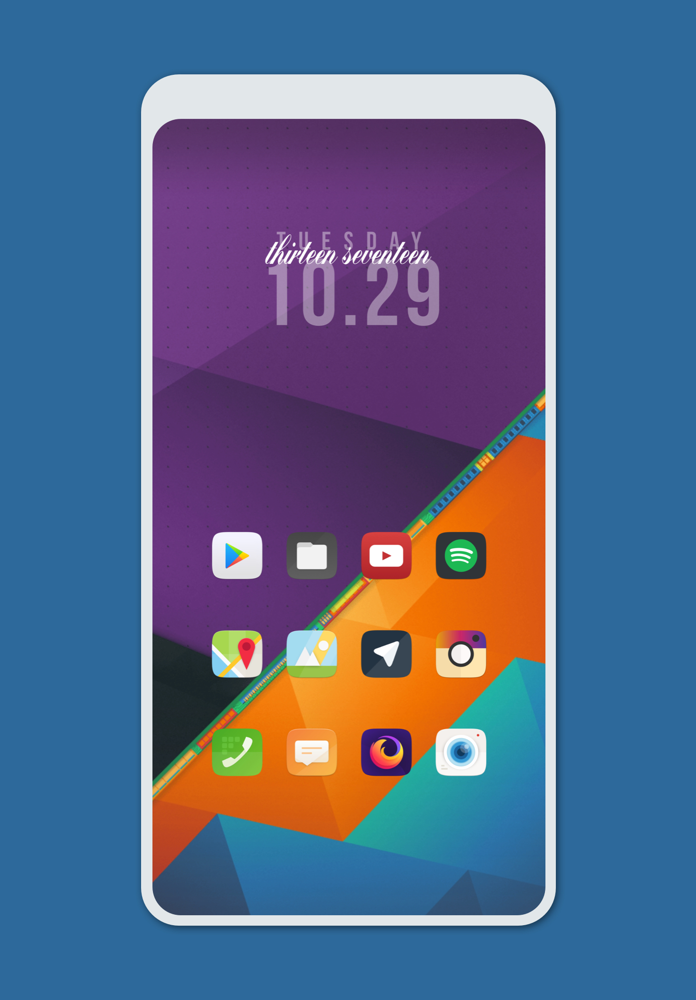
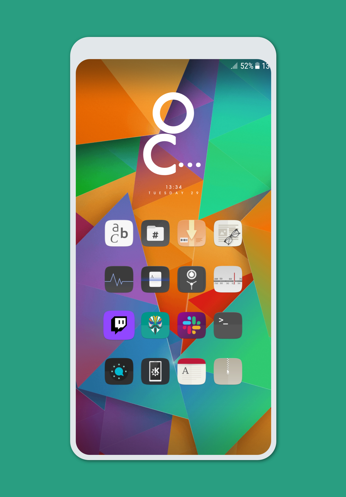

Ubuntu touch icon pack
======

Ubuntu touch icon pack for android launchers.

# Previews

---

# Developed by

### [Armin Shalchian](https://github.com/Rminsh)

## Special thanks 🙌

- [Bardia Daneshvar](https://github.com/realbardia) 🛠
- [BluePrint Team](https://github.com/jahirfiquitiva/Blueprint) for Speeding up our icon pack development 📱
- [Suru icon theme](https://github.com/snwh/suru-icon-theme) for default icons 🎨

---

# License

 Ubuntu touch icon pack by <a xmlns:cc="http://creativecommons.org/ns#" href="https://github.com/Rminsh" property="cc:attributionName" rel="cc:attributionURL">Armin Shalchian</a> is licensed under a <a rel="license" href="http://creativecommons.org/licenses/by-nc/4.0/">Creative Commons Attribution-NonCommercial 4.0 International License</a>. Based on a work at <a xmlns:dct="http://purl.org/dc/terms/" href="https://github.com/Rminsh/Ubuntu_touch_iconPack" rel="dct:source">https://github.com/Rminsh/Ubuntu_touch_iconPack</a>.